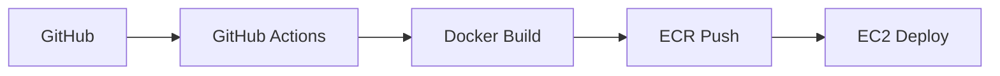

# 🐾 PETORY

<div align="center">


🐕**Chill Man과 함께하는 웹 플랫폼?**🐈‍⬛

[[📖 API 문서]](https://chill-logistics.shop/swagger-ui/index.html)
</div>

## 👥 팀원 소개


# 2. Team Members (팀원 및 팀 소개)
| 구대윤 | 김하정 |                 김승중    | 박설빈 |
|:------:|:------:|:--------------------------------------------------------------------------------------:|:------:|
|  |  |  |  |
| 팀장 | 서기 |                                          코드관리                                          | 문서관리 | 발표자 |
| [GitHub](https://github.com/kookong2) | [GitHub](https://github.com/mueiso) |                         [GitHub](https://github.com/kimsj0970)                         |                  [GitHub](https://github.com/seolbin01)                  |

<br>

## 💡 프로젝트 소개

> **"B2B 환경에서 허브 기반 배송 흐름을 관리하는 물류 관리 플랫폼"**

**Chill-Logistics는 B2B 물류 환경에서 발생하는**

**허브 기반 배송 흐름을 체계적으로 관리하기 위해 설계된 물류 관리 플랫폼입니다.**

B2B 물류는 단순한 출고·배송이 아니라,

**`주문` → `허브 간 이동` → `업체 배송` → `상태 추적` → `담당자 배정`**까지

여러 단계가 비동기적으로 연결되며, 각 단계는 서로 다른 도메인과 시스템에 의해 처리됩니다.

Chill-Logistics는 이러한 복잡한 흐름을 이벤트 기반 아키텍처로 분리·연결하여

각 도메인이 독립적으로 확장 가능하면서도 전체 흐름은 일관되게 유지되도록 설계되었습니다.
  
<br>

### 🎯 해결하고자 하는 문제

기존 물류 시스템에서의 다음과 같은 문제가 반복적으로 발생하는 것을 해결하고자 했습니다.

**해결하고자 한 문제:**

- 주문, 허브, 배송 로직이 하나의 시스템에 강하게 결합됨
- 허브 간 배송 단계가 명확한 도메인으로 분리되지 않음
- 배송 생성 실패 시 전체 흐름이 깨지는 문제
- 배송 상태 변경, 담당자 배정, 알림 로직이 뒤섞여 유지보수가 어려움

<br>

## 🛠️ 기술 스택

### Backend


### Database & Storage


### DevOps & Infrastructure
[](https://www.docker.com/)


### Test & Monitoring


### External APIs


### Development Tools


### Collaboration


## ✨ 주요 기능

### ❄️ 도메인 분리 기반 마이크로서비스 구조
- User Server
  - 회원가입 및 로그인
  - 권한 별 접근 제한
  - Passport 적용
- Order Server
  - 주문 생성 및 상태 관리
  - 주문 생성 시 이벤트 발행
  - 주문 취소 시 이벤트 발행
- Hub Server
  - 다익스트라 알고리즘을 적용해 출발 허브 → 도착 허브 최적 이동 경로 계산
  - 계산된 허브 이동 경로를 기준으로 카카오맵 API를 연동하여 **실시간 예상 소요 시간 산출**
- Delivery Server
  - 허브 배송 / 업체 배송 생성
  - 배송 상태 변경 및 배송 담당자 배정

### ❄️ Kafka 기반 이벤트 드리븐 흐름
- 주문 생성 → **`OrderAfterCreate`** 이벤트 발행
- 허브 경로 계산 → **`HubRouteAfterCreate`** 이벤트 발행
- 배송 서버는 이벤트를 구독하여 배송 엔티티 생성

➡️ 이 구조를 통해:
- 서비스 간 직접 호출을 최소화
- 장애 발생 시 영향 범위 제한
- 향후 도메인 확장(결제, 정산 등)에 유리한 구조 확보


### ❄️ 신뢰성을 고려한 메시지 처리
- Outbox 패턴을 적용해 DB 트랜잭션과 이벤트 발행 간 정합성 보장
- 배송 생성 실패 시를 고려한 보상 흐름 (Saga 관점)설계
- 이벤트 중복 처리 및 재시도를 고려한 구조

### ❄️ 운영 관점 기능 설계
- 배송 담당자 자동 배정
- 배송 마감 시한 계산 및 외부 알림(Discord)연계
- 조회 API는 커스텀 페이지 구조로 관리 편의성 확보

### ❄️ 서버
- Raspberry Pi 3대를 사용해 서비스 운영 환경(홈 클러스터) 구성
- Cloudflare를 활용해 SSL 인증서 적용 및 외부 접근 보호
- CI/CD 파이프라인을 구성하여 빌드 · 배포 자동화


## 🏗️ 시스템 아키텍처


### 🔧 인프라 구성
| 서비스 | 사양 | 역할 |
|--------|------|------|
| **EC2** | t3.medium | 애플리케이션 서버 |
| **RDS** | t4g.micro (MySQL) | 관계형 데이터베이스 |
| **ElastiCache** | t2.micro (Redis OSS) | 캐싱 및 세션 관리 |
| **ECR** | Private Repository | 컨테이너 이미지 저장 |
| **S3** | Standard | 사용자 업로드 파일 관리 |
| **MongoDB Atlas** | - | 채팅 데이터 저장 |


### 🚀 CI/CD 파이프라인




## 💫 주요 기술적 의사결정

<details>
<summary>☀️ JWT + Redis 기반 보안 강화</summary>

**🔹 배경**
- JWT의 무상태 특성으로 로그아웃 후에도 토큰이 유효기간 내라면 인증된 것처럼 동작하는 보안 취약점 발견
- 토큰 탈취 시 즉각적인 대응이 어려운 구조적 문제점 인식

**🔹 비교**
- Session 방식: 서버 메모리 사용량 증가, 확장성 제약
- JWT만 사용: 로그아웃 처리 불가, 토큰 무효화 어려움
- JWT + Redis: 무상태성 유지하면서 실시간 토큰 제어 가능

**🔹 결론**
- Redis 블랙리스트와 TTL을 활용한 JWT 보안 강화 구현
- 로그아웃 시 AccessToken 블랙리스트 등록으로 즉시 차단, 자동 만료로 서버 부하 최소화
</details>

<details>
<summary>☀️ MongoDB Atlas 선택 (vs DocumentDB)</summary>

**🔹 배경**
- 채팅 기능 구현을 위한 NoSQL 데이터베이스 필요
- AWS DocumentDB와 MongoDB Atlas 중 선택 고민

**🔹 비교**
- DocumentDB: AWS 네이티브 통합 우수, 하지만 MongoDB 100% 호환성 미보장
- MongoDB Atlas: 완전한 MongoDB 호환성, 무료 티어 제공
- 호환성 리스크: DocumentDB는 버전 차이로 인한 쿼리 동작 차이 가능성

**🔹 결론**
- 기존 코드와의 100% 호환성과 개발 일정을 고려하여 MongoDB Atlas 선택
- 안정성과 빠른 배포를 우선시한 현실적 판단
</details>

<details>
<summary>☀️ MongoDB에 바이너리 파일 적재하기</summary>

**🔹 배경**
- 사용자가 채팅을 보낼 때 사진 보내기 기능이 필요했습니다.
- 현재 MongoDB를 사용해 채팅을 저장 중이며,  
  `@MessageMapping` 어노테이션과 `messagingTemplate`을 활용해 웹소켓 기반 채팅을 구현했습니다.
- 이로 인해 다음과 같은 문제점이 발생했습니다:
    - 바이너리 파일 저장 시 base64로 인코딩이 필요함
    - 클라이언트가 저장 요청을 보낼 때, 이미지 형식이 맞는지 서버에서 검증해야 함

**🔹 고려 사항**

| 항목 | 고려 사항 |
|------|------------|
| 파일 저장 방식 | S3로 업로드 → MongoDB에는 URL만 저장 |
| 업로드 성공 여부 | 클라이언트가 파일을 업로드한 후 서버에 알려야 함 |
| 파일 타입 | 잘못된 파일이 저장되지 않도록 업로드 시 검증 필요 |
| 저장 항목 | 파일명, MIME 타입, S3 URL, 유저 ID 등 |

**🔹 결론**
- 클라이언트가 **Presigned URL**을 통해 S3에 직접 사진을 업로드하도록 구현
- 서버는 업로드 URL만 응답하고, 클라이언트가 업로드 완료 후 해당 URL을 DB에 저장 요청
- 이렇게 하여 **파일 유효성 검증 부담을 줄이고**, **서버 부하 및 비용도 절감**
</details>


<details>
<summary>☀️ Grafana + Loki 모니터링</summary>

**🔹 배경**
- AWS 기반 운영 환경에서 시스템 상태 실시간 모니터링 필요
- 장애 상황 빠른 파악과 대응을 위한 가시화된 모니터링 체계 구축

**🔹 비교**
- 로그만 사용: 문제 파악에 시간 소요, 사후 대응적
- CloudWatch: AWS 네이티브하지만 커스터마이징 제약
- Grafana + Prometheus: 유연한 대시보드, 다양한 데이터 소스 연동 가능

**🔹 결론**
- Spring Boot Actuator와 Prometheus 연동으로 메트릭 수집
- Grafana 대시보드로 CPU, 메모리, HTTP 응답시간 등 실시간 모니터링 구현
</details>


## 📈 모니터링

**Grafana + Prometheus 모니터링 시스템**
- **시스템 메트릭**: CPU, 메모리, 네트워크 사용량 실시간 모니터링
- **애플리케이션 메트릭**: HTTP 응답 시간, DB 지연 시간 추적


## 📊 성능 개선

<details>
<summary>🚀 스프링 배치를 통한 91% 성능 개선</summary>

**🔹 기능 소개**
- 매일 자정마다 유저에게 데일리 질문 알림을 발송하는 기능 구현
- `Notification` 엔티티를 사용해 유저와 알림 내용을 저장

**🔹 기술 결정 과정**
- 기존 `findAll()` + 반복 저장 방식은 유저 수 증가 시 병목 발생
- Spring Batch + `chunk` 기반 처리로 대체
- `TaskExecutor`로 멀티스레드 병렬 처리 적용

**🔹 성능 테스트 결과**
- 기존 방식: 10만명 기준 평균 **58초**
- Spring Batch + 비동기 처리: **7초**
- JdbcCursorItemReader로 리팩토링 후: **5초**
- **총 91.3% 성능 개선** 달성

**🔹 회고**
- 단순 반복 저장 방식의 병목 문제를 Spring Batch로 해결
- reader/processor/writer 구조와 JDBC vs JPA 차이 학습
- 향후 파티셔닝 도입 및 병렬 Step 처리 고려 예정

</details>

<details>
<summary>🚀 Redis 캐싱을 통한 인기 랭킹 성능 개선</summary>

**🔹 기능 소개**
- 인기 장소 랭킹 데이터를 Redis에 캐싱하여 빠르게 조회

**🔹 기술 결정 과정**
- 기존 방식: QueryDSL로 DB 직접 조회 (좋아요 수 기준 정렬)
- 리팩토링 방식: Redis ZSet을 사용해 랭킹 구현
    - 좋아요 시 score 증가, 취소 시 감소
    - 캐시된 `placeId`로 DB에서 상세 데이터 조회

**🔹 성능 테스트 결과 (JMeter + Grafana)**
- 평균 응답시간: **509ms 개선 (약 3.1%)**
- 최소 응답시간: **5ms (SQL 대비 15배 빠름)**
- 3000명 동시 접속 시 **0% 오류율**
- Redis가 응답 지연과 부하 분산에 효과적임 확인

**🔹 회고**
- Redis 도입으로 캐시 기반 구조의 이점 체감
- 과부하 상황에서 서버 자원 한계를 시각화하며 대응 전략 필요성 인지
- 추후 TTL 설정, 조회 필드 최적화, 인덱싱 등도 개선 포인트로 도출

</details>


## 🚨 주요 트러블슈팅

<details>
<summary>⚠️ Docker 빌드 캐시 이슈</summary>

- **문제**: 코드 수정 후 배포했으나 변경사항이 반영되지 않음<br/>
- **원인**: Docker 레이어 캐시로 인해 소스코드 변경이 감지되지 않음<br/>
- **해결**: `--no-cache` 옵션 사용 및 빌드 단계 최적화

</details>

<details>
<summary>⚠️ JPA Lazy Loading으로 인한 401 에러</summary>

- **문제**: Security 설정에 문제없음에도 401 Unauthorized 발생<br/>
- **원인**: LazyInitializationException이 Security Filter에서 401로 변환됨<br/>
- **해결**: QueryDSL fetch join 적용 및 GlobalExceptionHandler 보강<br/>

</details>

<details>
<summary>⚠️ Rate Limiting 버킷 초기화 문제</summary>

- **문제**: Bucket4j Rate Limiting이 매 요청마다 초기화됨<br/>
- **원인**: BucketConfiguration이 매번 새로 생성됨<br/>
- **해결**: 필드 레벨에서 고정된 Configuration 사용

</details>

## 🛡️ Test Coverage


## 🗂️ 프로젝트 구조

```
📦 petory
├── 📂 src/main/java/com/study/petory
│   ├── 📂 common                  # 공통 유틸리티 및 설정
│   │   ├── 📂 config              # 설정 클래스들
│   │   ├── 📂 entity              # 공용 엔티티
│   │   ├── 📂 exception           # 예외 처리
│   │   ├── 📂 ratelimit           # 별점 처리
│   │   ├── 📂 response            # 공통 응답
│   │   ├── 📂 scheduler           # 스케쥴러
│   │   ├── 📂 security            # 보안 설정
│   │   ├── 📂 service             # 공용 서비스
│   │   └── 📂 util                # 유틸리티 클래스
│   ├── 📂 domain
│   │   ├── 📂 album               # 반려동물 사진 저장
│   │   ├── 📂 chat                # 채팅 기능
│   │   ├── 📂 dailyqna            # 데일리 질문
│   │   ├── 📂 event               # 일정 관리
│   │   ├── 📂 notification        # 알림 기능
│   │   ├── 📂 ownerBoard          # 커뮤니티 게시판
│   │   ├── 📂 pet                 # 반려동물 관리
│   │   ├── 📂 place               # 장소 관리
│   │   ├── 📂 tradeboard          # 중고거래 게시판
│   └── └── 📂 user                # 사용자 관리
├── 📂 src/main/resources
│   ├── 📂 static                  # 정적 리소스
│   ├── 📂 templates               # Thymeleaf 템플릿
│   └── 📄 application.properties  # 애플리케이션 설정
├── 📄 docker-compose.yml    
└── 📄 Dockerfile
```


## 📝 API 문서

자세한 API 문서는 [Postman Documentation](https://documenter.getpostman.com/view/43234443/2sB2xE9ndC)에서 확인하실 수 있습니다.

### 주요 API 엔드포인트

| 기능 | Method | Endpoint | 설명 |
|------|--------|----------|------|
| 로그인 | GET | `/oauth2/authorization/google` | Google OAuth2 로그인 |
| 반려동물 등록 | POST | `/pet` | 사용자의 반려동물 등록 |
| 앨범 조회 | GET | `/users/my/albums` | 사용자가 기록한 사진 전체 조회 |
| 데일리 질문 | GET | `/daily-questions/today` | 오늘의 질문 조회|
| 플레이스 검색 | GET | `/places` | 반려동물 동반 장소 조회 |
| 게시글 목록 | GET | `/owner-boards` | 커뮤니티 게시글 전체 조회|
| 채팅 시작 | GET | `/chat/{chatId}` | 채팅방 입장 |
| 알림 전체 조회 | GET | `/notifications` | 오늘의 질문 알림 조회|
| 일정 생성 | POST | `/users/events` | 일정 생성 |


## 🏆 향후 개선 계획

### 🔦 기능 확장
- [ ] 캘린더에서 반려동물 D-day 알림 추가
- [ ] 반려 동물의 성장 일지 기록하기

### 🔐 보안 강화
- [ ] Parameter Store를 통한 환경변수 중앙 관리
- [ ] Private Subnet으로 EC2 이동 및 NAT Gateway 구성

### 📈 확장성 개선
- [ ] Auto Scaling Group 적용
- [ ] Application Load Balancer 도입

### 🚀 성능 최적화
- [ ] Spring Batch 파티셔닝 적용

---

<div align="center">


**🐾 PETORY와 함께 반려동물과의 소중한 순간을 기록하세요! 🐾**

Made with ❤️ by PETORY Team
</div>
