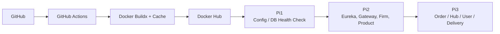

# ❄️ Chill-Logistics

<div align="center">


🐕**B2B 환경에서 허브 기반 배송 흐름을 관리하는 물류 관리 플랫폼**🐈‍⬛

[[📖 API 문서]](https://chill-logistics.shop/swagger-ui/index.html)
</div>

## 👥 팀원 소개


# 2. Team Members (팀원 및 팀 소개)
| 구대윤 | 김하정 |                 김승중    | 박설빈 |
|:------:|:------:|:--------------------------------------------------------------------------------------:|:------:|
|  |  |  |  |
| 팀장 | 서기 |                                          코드관리                                          | 문서관리 | 발표자 |
| [GitHub](https://github.com/kookong2) | [GitHub](https://github.com/mueiso) |                         [GitHub](https://github.com/kimsj0970)                         |                  [GitHub](https://github.com/seolbin01)                  |

<br>

| 팀원명     | 포지션     | 담당(개인별 기여점)                                                                                                                                                                                                                                                                                                                                                                                                                                                                                                                  |
| ------- | ------- | ---------------------------------------------------------------------------------------------------------------------------------------------------------------------------------------------------------------------------------------------------------------------------------------------------------------------------------------------------------------------------------------------------------------------------------------------------------------------------------------------------------------------------- |
| **구대윤** | 팀장 / BE | **유저 관리**<br/>- Master 권한의 일반 유저 관리 API 설계<br/>- 일반 유저 정보 조회 API 설계<br/><br/>**Security**<br/>- 로그인 / 회원가입 기능 구현<br/>- Client ↔ Server JWT 기반 인증·인가<br/><br/>**Passport**<br/>- Gateway Passport 발급 구현<br/>- Server ↔ Server Passport 적용<br/>- 서비스 간 Kafka 메시지 서명 검증 후 처리<br/><br/>**Swagger 문서 관리**<br/>- API Gateway 기준 외부 노출 API 명세 중앙 관리<br/><br/>**Config Server 관리**<br/>- application.yml 중앙 관리를 위한 Git Repository 구성<br/>- Config Server 기반 설정 중앙 집중 관리                                                              |
| **김승중** | BE      | **MSA 프로젝트 관리**<br/>- 서비스 간 책임 경계(Bounded Context) 기준 서버 분리<br/>- 공통 라이브러리 분리 및 멀티 모듈 구조 적용<br/>(BaseEntity, 공통 Response, ErrorCode, Pagination)<br/><br/>**허브 / 업체 관리**<br/>- 허브 및 업체 기본 정보 관리 기능 구현<br/><br/>**허브 간 이동 정보 관리**<br/>- 다익스트라 알고리즘 기반 허브 이동 경로 계산<br/>- 카카오맵 API 연동 실시간 예상 소요 시간 산출<br/><br/>**서버 배포**<br/>- Raspberry Pi 기반 홈 클러스터 구성<br/>- Docker 컨테이너 기반 배포 환경 구축<br/>- CI/CD 파이프라인 구성 및 자동 배포<br/>- Cloudflare 기반 SSL 인증서 적용 및 외부 접근 보호<br/><br/>**로깅/모니터링**<br/>- Grafana + Loki 기반 로그 수집 및 조회 환경 구축     |
| **김하정** | BE      | **허브 배송 / 업체 배송 관리**<br/>- 허브 배송 N-row 생성 및 관리<br/>- 배송 구간 기반 상태 전이 설계<br/>(WAITING_FOR_HUB → MOVING_TO_HUB → ARRIVED_DESTINATION_HUB → MOVING_TO_FIRM → FIRM_DELIVERY_IN_PROGRESS → DELIVERY_COMPLETED / DELIVERY_CANCELLED)<br/>- 업체 배송 생성 및 관리<br/><br/>**Discord / AI 연계**<br/>- Discord Bot 기반 최종 물류 발송 시한 안내 기능 구현<br/>- Kafka 메시지 기반 주문·허브 데이터 활용<br/>- ChatGPT Open API 연동 최종 발송 시한 계산<br/><br/>**Kafka / Outbox**<br/>- OrderAfterCreate / HubRouteAfterCreate 이벤트 발행<br/>- Order Server Outbox 패턴 적용 및 Retry 정책 구현 |
| **박설빈** | BE      | **상품 관리**<br/>- Kafka 기반 비동기 재고 차감 처리 설계 및 구현<br/>- Redis 예약 재고 기반 동시성 제어<br/>- 스케줄러 기반 Redis → DB 재고 반영(30분 주기)<br/>- DB 비관적 락 기반 최종 정합성 보장<br/>- 재고 감소 완료 이벤트 발행<br/><br/>**주문 관리**<br/>- 이벤트 기반 주문 생성 흐름 설계<br/>- 주문 상태 전이 설계(CREATED → STOCK_PROCESSING → STOCK_CONFIRMED)<br/>- 재고 이벤트 수신 후 주문 상태 변경 처리<br/>- Idempotency-Key 기반 주문 멱등성 처리 구현<br/><br/>**Flyway**<br/>- 멀티 DB 환경 마이그레이션 구조 설계 및 운영<br/>- UUID v7(BINARY(16)) 기반 테이블 설계 및 관리<br/>- 제약조건·인덱스 변경 이력 관리 및 오류 대응                                             |

<br>

## 💡 프로젝트 소개

> **"B2B 환경에서 허브 기반 배송 흐름을 관리하는 물류 관리 플랫폼"**

**Chill-Logistics는 B2B 물류 환경에서 발생하는**

**허브 기반 배송 흐름을 체계적으로 관리하기 위해 설계된 물류 관리 플랫폼입니다.**

B2B 물류는 단순한 출고·배송이 아니라,

**`주문` → `허브 간 이동` → `업체 배송` → `상태 추적` → `담당자 배정`**까지

여러 단계가 비동기적으로 연결되며, 각 단계는 서로 다른 도메인과 시스템에 의해 처리됩니다.

Chill-Logistics는 이러한 복잡한 흐름을 이벤트 기반 아키텍처로 분리·연결하여

각 도메인이 독립적으로 확장 가능하면서도 전체 흐름은 일관되게 유지되도록 설계되었습니다.
  
<br>

### 🎯 해결하고자 하는 문제

기존 물류 시스템에서의 다음과 같은 문제가 반복적으로 발생하는 것을 해결하고자 했습니다.

**해결하고자 한 문제:**

- 주문, 허브, 배송 로직이 하나의 시스템에 강하게 결합됨
- 허브 간 배송 단계가 명확한 도메인으로 분리되지 않음
- 배송 생성 실패 시 전체 흐름이 깨지는 문제
- 배송 상태 변경, 담당자 배정, 알림 로직이 뒤섞여 유지보수가 어려움

<br>

## 🛠️ 기술 스택

### Backend


### Database & Storage


### DevOps & Infrastructure


### Test & Monitoring


### External APIs


### Development Tools


### Collaboration


<br>

## 🏗️ 시스템 아키텍처


## ✨ 주요 기능

### ❄️ 도메인 분리 기반 마이크로서비스 구조
- User Server
  - 회원가입 및 로그인
  - 권한 별 접근 제한
  - Passport 적용
- Order Server
  - 주문 생성 및 상태 관리
  - 주문 생성 시 이벤트 발행
  - 주문 취소 시 이벤트 발행
- Hub Server
  - 다익스트라 알고리즘을 적용해 출발 허브 → 도착 허브 최적 이동 경로 계산
  - 계산된 허브 이동 경로를 기준으로 카카오맵 API를 연동하여 **실시간 예상 소요 시간 산출**
- Delivery Server
  - 허브 배송 / 업체 배송 생성
  - 배송 상태 변경 및 배송 담당자 배정


### ❄️ Kafka 기반 이벤트 드리븐 흐름
- 주문 생성 → **`OrderAfterCreate`** 이벤트 발행
- 허브 경로 계산 → **`HubRouteAfterCreate`** 이벤트 발행
- 배송 서버는 이벤트를 구독하여 배송 엔티티 생성

➡️ 이 구조를 통해:
- 서비스 간 직접 호출을 최소화
- 장애 발생 시 영향 범위 제한
- 향후 도메인 확장(결제, 정산 등)에 유리한 구조 확보


### ❄️ 신뢰성을 고려한 메시지 처리
- Outbox 패턴을 적용해 DB 트랜잭션과 이벤트 발행 간 정합성 보장
- 배송 생성 실패 시를 고려한 보상 흐름 (Saga 관점)설계
- 이벤트 중복 처리 및 재시도를 고려한 구조


### ❄️ 운영 관점 기능 설계
- 배송 담당자 자동 배정
- 배송 마감 시한 계산 및 외부 알림(Discord)연계
- 조회 API는 커스텀 페이지 구조로 관리 편의성 확보


### ❄️ 서버
- Raspberry Pi 3대를 사용해 서비스 운영 환경(홈 클러스터) 구성
- Cloudflare를 활용해 SSL 인증서 적용 및 외부 접근 보호
- CI/CD 파이프라인을 구성하여 빌드 · 배포 자동화

<br>

## 🏗️ 주문 Flow Chart


## 🏗️ ERD


### 🔧 인프라 구성

| 구성 요소 | 역할                                        |
|---|-------------------------------------------|
| **Raspberry Pi 클러스터** | 여러 개의 서비스가 독립적으로 배포·실행되는 컨테이너 기반 운영 환경 구축 |
| **Cloudflare** | DNS 관리 및 SSL 인증서 적용으로 HTTPS 통신 구성         |
| **Loki + Grafana** | 분산 환경 로그 수집 및 서비스 상태 모니터링                 |

<br>

### 🚀 CI/CD 파이프라인




## 💫 주요 기술적 의사결정

<details>
<summary>☀️ Passport</summary>

- Clinet ↔ Server, Server ↔ Server간 API 통신 과정에서 하나의 JWT 인증으로 인증/인가를 처리하는 구조


- JWT가 탈취될 경우의 보안적인 문제 발생


- Kafka 메세지 기반 API 통신 과정에서 HTTP 통신 방식 


- Netflix의 Passport 개념을 도입하여 Clinet ↔ Server API 통신 과정에서는 JWT 인증/인가 방식을,
    Server ↔ Server간 API 통신 과정에는 Passsport를 적용


- **장점:**
  - 인증 방식을 쉽게 통합하고 관리할 수 있음
  - 외부 API 통신 방식에서는 인증 방식을, 내부 API 통신 방식에서는 Passport를 적용한 서비스 신뢰 방식을 도입해 인증/인가 방식에 대한 명확한 경계를 나눌 수 있음
  - 인증/인가 방식의 명확한 경계 나눔을 통해 보안성 강화

  
- **단점:**
  - HTTP 방식에서는 Gateway 필터, Feign 방식에서는 RequestInterceptor, Kafka 방식에서는 Consumer 인증 세팅을 통해 관리를 하게 되므로 디버깅 포인트가 많아짐


- **단점 보완 고려사항:**
  - 세부적인 모니터링을 통해 명확한 디버깅 포인트 설립 예정
</details>

<details>
<summary>☀️ Kafka</summary>

- **기술 도입 이유:** Chill-Logistics의 주문 → 허브 → 배송 흐름은
  여러 서비스가 순차적으로 관여하며, 각 단계에서 실패, 지연, 재시도가 발생할 수 있는 구조입니다.


- 이러한 특성에 맞춰 서비스 간 연결 방식을
REST 중심의 동기 호출이 아닌, Kafka 기반 Event-Driven 방식으로 설계했습니다.


- 이를 통해 각 서비스가 서로의 가용성에 직접 의존하지 않고,
비동기적으로 흐름을 이어갈 수 있도록 했습니다.
&nbsp;


- **장점:**
  - 생산자–소비자 간 느슨한 결합
    ▸ 브로커(Kafka)를 통한 연결로 서비스 간 직접 의존성 제거
  - 비동기 처리 기본 구조
    ▸ 메시지 버퍼링을 통한 지연 허용, 재처리 가능
  - 장애 전파 최소화
    ▸ 소비자 장애 시에도 메시지 보관
    ▸ 서비스 복구 후 재처리 가능
  - 처리량 확장에 유리
    ▸ 소비자 수평 확장을 통한 트래픽 대응
  - 비동기 처리 + 재시도 가능한 작업에 적합


- **단점:**
  - 운영 및 디버깅 난이도 증가
    ▸ REST 호출 대비 메시지 흐름 추적이 직관적이지 않음
    ▸ log, key 설계, 메시지 관찰 전략 필요
  - 설계 복잡도 증가
    ▸ 중복 처리, 메시지 순서, 재처리, DLQ(Dead Letter Queue) 등 고려 필요


- **단점 보완 고려사항:**
  - 메시지 중복 처리 가능성
    ▸ 멱등성(idempotency)을 고려한 소비자 로직 설계
  - 트랜잭션과 이벤트 발행 정합성
    ▸ Outbox 패턴 적용
  - 실패 재처리 전략
    ▸ 재시도 및 보상 흐름을 고려한 Saga 관점 설계
</details>

<details>
<summary>☀️ MSA </summary>

### MSA

- **기술 도입 이유:** .Chill-Logistics의 도메인은 주문 / 허브 / 배송 등으로 명확히 구분되며, 각 도메인은 변경 주기 / 트래픽 특성 / 장애 영향 범위가 서로 다릅니다.

- Monolithic구조에서는 이 도메인들이 하나의 애플리케이션에 결합되어 특정 기능의 변경이나 장애가 전체 시스템 배포 및 안정성에 직접적인 영햘을 주었습니다.

- 이에 따라 Chill-Logistics는 도메인 책임을 명확히 분리하고, 대규모 트래픽 기반 각 영역을 독립적으로 확장 및 배포하기 위해 MSA 구조를 선택했습니다.


- **장점:**
  - 도메인 책임 분리
    ▸ 주문, 허브, 배송을 독립 서비스로 분리
    ▸ 각 서비스는 자신의 비즈니스 규칙에만 집중
  - 독립 배포 및 확장
    ▸ 허브 경로 계산, 배송 생성 등 트래픽이 집중되는 서비스만 개별 확장 가능
  - 장애 격리
    ▸ 특정 서비스 장애가 전체 시스템 장애로 확산되는 것을 방지
  - 아키텍처 확장 용이
    ▸ 신규 도메인을 기존 서비스 변경 없이 추가 가능


- **단점:**
  - 시스템 복잡도 증가
    ▸ 서비스 수 증가로 인한 배포·운영 복잡도 상승
  - 분산 트랜잭션 문제
    ▸ 단일 트랜잭션으로 처리 불가
    ▸ 서비스 간 데이터 정합성 고려 필요
  - 관측 및 디버깅 난이도
    ▸ 호출/이벤트 흐름 추적이 모놀리식보다 어려움
  - 비용 증가
    - 인프라 비용 증가
      ▸서비스별 서버/컨테이너, DB 인스턴스 분리로 인한 리소스 사용량 증가
      ▸Kafka, Redis, Gateway, 모니터링 등 공통 인프라 추가 필요
    - 운영 및 관리 비용 증가
      ▸ 장애 대응, 스케일링, 설정 관리 대상 서비스 수 증가
      ▸ 서비스 증가에 따라 환경별 설정, 시크릿, 연결 정보, 정책을 서비스 단위로 관리해야 하며
      설정 불일치 및 배포 누락 위험이 커져 운영 비용과 장애 가능성 증가
    - 관측/모니터링
      ▸ 분산 트레이싱, 메트릭 수집을 위한 별도 도구 도입 필요
      ▸ 서비스 간 호출/이벤트 흐름 가시성 확보를 위한 추가 설정 및 운영 부담 발생


- **단점 보완 고려사항:**
  - 이벤트 기반 통신 채택
    ▸ REST 중심의 강한 결합을 피하고 Kafka 이벤트로 서비스 연결
  - Outbox 패턴 적용
    ▸ 로컬 트랜잭션과 이벤트 발행 간 정합성 확보
  - Saga 관점의 실패 처리
    ▸ 단계별 실패에 대한 보상 흐름 설계
  - 도메인 경계 명확화
    ▸ 계약(API/Event 스키마) 중심 통신
</details>


<details>
<summary>☀️ Flyway</summary>

- **기술 도입 이유:**
  - 멀티 DB 환경에서 스키마 변경 이력을 코드로 관리하고, 로컬, 운영 환경 간 DB 구조 불일치를 방지하기 위해 도입


- 장점:
  - SQL 기반 마이그레이션으로 DB 변경 이력의 명시적 관리 가능
  - DB별(mysq1, mysql2, mysql3) 마이그레이션 경로 분리로 MSA 환경에 적합
  - 애플리케이션 시작 시 자동 검증으로 스키마 누락, 순서 오류 조기 탐지


- 단점:
  - 이미 반영된 마이그레이션 스크립트는 수정이 어려워 초기 설계 오류 시 대응 비용이 큼
  - CHECK 제약조건, FK 변경 등은 실행 시점에야 오류가 드러나는 경우가 있음


- 단점 보완 고려사항:
  - 운영 반영 전 로컬 환경에서 마이그레이션 선검증 프로세스 강화
  - 변경 가능성이 높은 스키마는 분리된 버전으로 관리하거나, ALTER 중심의 점진적 변경 전략 적용
  - 마이그레이션 실패 시 원인 추적을 위해 스크립트 단위 책임 범위 최소화
</details>


<details>
<summary>☀️ Config </summary>

- **기술 도입 이유:**
  서비스마다 `application.yml`, 환경변수, 시크릿 등의 설정이 많아지면 운영 난이도 상승
  누가/언제/왜 바꿨는지 이력 관리 필요


- **장점:** .
  - 설정을 한 곳에서 관리하기 때문에 운영에 수월해짐
  - Git 기반으로 운영하기 때문에 변경 이력 및 롤백 용이


- **단점:** .
  - Config 서버 죽으면 신규 기동/스케일아웃이 막힐 수 있음


- **단점 보완 고려사항:** .
  - 다중 인스턴스 + 로드밸런서
  - 마지막으로 성공적으로 가져온 설정을 디스크/메모리에 캐싱하고, Config 서버 장애 시 캐시로 기동 가능
</details>
  

## 🚨 주요 트러블슈팅

<details>
<summary>⚠️ Order 동시성 문제 해결</summary>

### 1️⃣ **문제 상황**

- **동시 주문 환경에서 정합성 문제 발생**
    - 재고 50개 상황에서 250건의 주문 요청이 동시에 유입하는 상황
    - 요청 중 다수가 실패했지만, 재고 수량을 초과한 **52건의 주문이 생성되는 오버셀링 발생**
- **중복 요청 가능성 존재**
    - 클라이언트 타임아웃, 중복 클릭, 네트워크 재시도 등으로
        
        동일 주문이 여러 번 요청될 수 있는 상황
        
    - 요청 단위에서 **중복 주문 처리 위험** 존재

### 2️⃣ 원인 분석

- **동시성 제어 부족**
    - 여러 주문 요청이 동시에 처리되면서
        
        재고 차감 로직의 원자성이 보장되지 않음
        
- **실시간 DB 재고 차감의 한계**
    - 고동시성 환경에서 DB 기반 재고 차감은 경합이 심해지고,
        
        재고 상태 반영 지연으로 오버셀링 발생
        
- **요청 단위 중복 처리 미흡**
    - 동일 요청을 구분할 수 있는 기준이 없어
        
        재시도 상황에서 중복 주문 가능성 존재
        

### 3️⃣ 해결 방법

- **Redis 기반 예약 재고(Reservation Stock) 도입**
    - 주문 시 DB 실재고를 즉시 차감하지 않고,
        
        Redis에서 예약 재고를 먼저 차감
        
    - Redis Lua 스크립트를 사용해 재고 차감과 로그 기록을 원자적으로 처리
- **비관적 락을 활용한 DB 최종 정합성 보장**
    - 30분 주기 스케줄러를 통해
        
        Redis에 누적된 재고 차감 로그를 기반으로 DB 실재고를 일괄 반영
        
    - 이 과정에서 **DB 업데이트 구간에만 비관적 락(PESSIMISTIC_WRITE)** 적용
- **멱등성 처리(Idempotency-Key) 도입**
    - 요청마다 멱등성 키를 사용해 중복 요청 여부를 판단
    - 이미 처리된 요청은 재처리하지 않도록 차단
    - 요청 상태를 IN_PROGRESS / COMPLETED / FAILED로 관리

### 4️⃣ 결과

- **오버셀링 문제 해결**
    - Redis 예약 재고로 실시간 동시성 부하를 흡수하고,
        
        DB 비관적 락으로 최종 정합성 확정
        
- **중복 주문 방지**
    - 멱등성 키 적용으로 요청 단위 중복 처리 문제 해결
- **성능과 정합성의 균형 확보**
    - 실시간 경합은 Redis에서 처리하고,
        
        DB는 배치 시점에만 정합성을 보장하여
        
        성능과 정합성 간 트레이드오프를 관리 가능한 수준으로 통제

</details>

<details>
<summary>⚠️ 허브 간 실시간 예상 소요시간 Caching</summary>

### 1️⃣ 문제 상황

- 출발지에서 목적지까지 다이렉트가 아닌 정해진 허브 간 이동 경로들을 카카오 맵 API를 통해 실시간 예상 소요 시간을 산출 할 때 매번 외부 API 호출 시 오래 걸리는 지연 시간 발생
- **서울 ->  부산 허브까지의 계산 시간 (약 16 초 소요)**

### **2️⃣ 원인 분석**

- 외부 지도 API 호출은 네트워크 지연이 필연적으로 발생
- 동일 요청에 대한 **중복 API 호출이 성능 저하의 주요 원인**으로 판단
- 실시간성이 요구되지만, 5분 이내 동일 경로에 대한 결과는 큰 변동이 없음


### 3️⃣ **해결 방법**

- 허브 간 소요 시간을 Kakao Map API를 사용하여 호출 -> Redis에 5분 TTL 설정 후 값 저장
- **동일 경로 요청이 5분 이내에 발생할 경우** 외부 API를 재호출하지 않고 Redis에 저장된 기존 계산 결과를 재사용하는 Caching 전략 적용
- Redis TTL 임박 시 Refresh-Ahead + single-flight 전략을 적용해, 첫 요청만 외부 API를 호출하고, 나머지 요청은 기존 캐시(stale)를 즉시 반환하도록 개선하여 캐시 스탬피드 방지

### 4️⃣ 결과
- 동시 사용자 200명(20,000건 요청) 부하에도 평균 336ms로 응답 시간 안정화
- Redis 장애 시 DB Bulkhead 전략을 적용해 Redis 장애가 DB 및 외부 API 장애로 확산되는 것을 차단


</details>

<details>
<summary>⚠️ Passport 도입 배경</summary>

### 1️⃣ **문제 상황**

**상황 설명**

- JWT 인증을 사용하여 외부와의 인증은 관리되지만, 내부 서비스 간의 인증을 어떻게 처리할지에 대한 문제 발생
- 각 서비스는 JWT 인증을 사용하고 있지만, 내부 통신에서는 JWT를 그대로 사용하기 어려운 상황 (Kafka 이벤트 과정에서 Feign 호출을 할 때 401문제 발생)
- 내부 서비스 간의 인증/인가를 어떻게 처리할지 모호하고, 서비스 간의 신뢰를 보장할 방법이 필요
- 서비스 A에서 서비스 B로 요청을 보낼 때 JWT를 그대로 전달하는 방식은 보안상 위험이 있을 수 있고, 서로 다른 JWT 검증 로직이 중복될 위험이 있음

### **2️⃣ 해결해야 하는 부분**

- 각 서비스가 JWT를 직접 검증하면 중복된 인증이 발생하고, JWT 정보를 내부에 계속 전달하게 되어 정보 유출이나 탈취의 위험이 커짐
- Passport는 서비스 간 신뢰를 보장하는 인증 방식으로, 각 서비스가 Passport를 발급하고 다른 서비스가 이를 검증하는 방식으로 구현할 필요가 있음

**서비스 간 통신 시 인증 방식의 차이**

- 내부 서비스 간의 인증을 JWT로 처리하면 JWT를 Request Header에 실어 전달해야 하지만, Kafka 기반 통신 과정에서는 이 방식이 어려움
- JWT를 헤더에 포함시키지 않으면, 내부 서비스 간 신뢰를 어떻게 인증할지에 대한 고민이 필요

**JWT와 Passport 인증의 경계 불분명**

- 각 서비스가 JWT를 직접 검증하면 중복된 인증이 발생하고, JWT 정보를 내부에 계속 전달하게 되어 정보 유출이나 탈취의 위험이 커짐
- Passport로 인증하는 방식을 사용하려면, 내부 서비스 간 신뢰를 어떻게 보장할지에 대한 명확한 기준이 필요

**서비스 간 통신 시 인증 방식의 차이**

- 내부 서비스 간의 인증을 JWT로 처리하면 JWT를 Request Header에 실어 전달해야 하지만, Kafka 통시에서는 이 방식이 어려움
- JWT를 헤더에 포함시키지 않으면, 내부 서비스 간 신뢰를 어떻게 인증할지에 대한 고민이 필요


### 3️⃣ **해결 방법**

**JWT와 Passport 인증의 경계 명확히 구분**

- Gateway에서 JWT를 검증하고, 내부 서비스는 Passport를 사용하여 인증하도록 변경
- 각 서비스는 PassportIssuer를 사용하여 Passport를 발급하고, Service Principal을 통해 내부 요청에 대한 신뢰를 보장
  
- 


**Kafka 및 Feign 통신에서의 인증 처리**
- Kafka와 Feign에서의 인증 헤더 처리 방식도 Passport로 통일하여, JWT 대신 Passport 헤더를 포함하여 인증을 처리
- 
- Kafka와 Feign 에서는 ServicePassport를 사용하여 내부 서비스 간의 신뢰를 보장하고, Authorization 헤더를 따로 전달하지 않게 구현하여 보안상 위험 관리

### **4️⃣ 결과**

**인증 경계 명확한 구분**

- Gateway에서 JWT를 검증하고, 내부 서비스는 Passport로 인증을 처리하는 구조로 변경됨
- 외부와 내부의 인증 흐름을 명확히 구분하고, 각 서비스가 독립적으로 동작하게 됨

**내부 서비스 간 인증의 단순화**

- Passport를 사용하여 내부 서비스 간 신뢰를 보장할 수 있게 됨
- Kafka/Feign 에서는 Passport 헤더를 이용한 인증을 처리하므로, 내부 호출의 인증 방식이 일관되게 유지됨

**보안성 향상**

- JWT를 내부로 전달하지 않고 Passport만 사용하여 인증을 처리하므로 내부 서비스 간 보안이 강화됨
- JWT 토큰이 내부 서비스로 전달되지 않으므로 정보 탈취나 노출 위험이 줄어듦

</details>


<details>
<summary>⚠️ CD 파이프라인 빌드 병목 개선</summary>

### 1️⃣ 문제 상황

- MSA 구조로 서비스 수가 많아지면서, GitHub Actions에서 **Docker 이미지 빌드 시간이 과도하게 증가**
- 결과적으로 작은 수정(일부 서비스 변경)에도 **전체 빌드가 길게 잡혀 CI/CD 전체 리드타임이 지나치게 커지는 문제 발생**

- **Docker 이미지 빌드 + Docker Hub push에만 약 1시간 20분 소요되는 상황이며**
- 이후 각 Raspberry Pi 서버에 접속하여 **이미지를 전체 pull 후 컨테이너를 재기동하는 데 추가로 약 30분 소요**
- 

### 2️⃣ 원인 분석

1. **파일의 변경 여부와 무관하게 모든 서비스의 Docker 이미지를 순차적으로 빌드**하는 구조
2. Raspberry Pi 운영 환경 특성상 (ARM64)  **멀티 아키텍처 빌드(또는 ARM 빌드)**가 필요했고, 이 과정에서 빌드 시간이 더 늘어남 (기본 빌드는 ADM)
3. Docker 이미지 빌드 시 **빌드 캐시가 충분히 활용되지 않아** 매번 거의 전체 빌드가 수행됨
- 결과적으로 “일부 서비스 수정”이라는 작은 변경에도 **과도한 CI 비용과 대기 시간**이 발생


### 3️⃣ 해결 방법
- 변경 감지 기반 빌드 전략 도입
  - 서비스별 디렉토리 기준으로 변경 여부를 판별하여, **실제로 변경된 서비스만 빌드 및 push**하도록 CI 파이프라인 재설계
- 빌드 단계 구조 재편
  - **Matrix 전략을 적용해 병렬 빌드** 수행 (병렬 빌드 수를 제한하여 CI 리소스 과부하 방지)
- Docker 빌드 성능 최적화
  - Registry 기반 빌드 캐시를 적용해 **기존 레이어 재사용**
  - 변경 없는 서비스는 빌드·push 자체를 생략하도록 구성


### 4️⃣ 결과
- Docker 이미지 **빌드 + push 시간 대폭 감소**
- 단순 자동화가 아닌 **확장성과 유지보수를 고려한 파이프라인 완성**
- 
</details>


<details>
<summary>⚠️ Outbox 도입</summary>

### 1️⃣ 문제 상황

- 초기 주문 생성 흐름은 다음과 같은 문제 발생
  - Order Server에서 주문 트랜잭션 커밋 → 커밋 직후 Kafka로 주문 생성 이벤트 발행 → 주문 트랜잭션은 정상적으로 커밋되었으나 Kafka 이벤트 발행이 실패하는 상황 발생
  - Kafka 일시 장애 / 네트워크 오류 / 브로커 타임아웃 등
  - 주문 데이터는 DB에 존재하지만 후속 서비스(Hub / Delivery)는 이벤트를 받지 못해 주문 흐름이 중단되는 현상 발생

### 2️⃣ 원인 분석

- DB 트랜잭션과 Kafka 이벤트 발행은 서로 다른 시스템에 걸쳐 존재
- 두 작업을 같은 트랜잭션 커밋 단위로 묶을 수 없음 → DB는 커밋되었지만 이벤트는 유실 → 또는 이벤트는 발행되었지만 DB 트랜잭션은 롤백
- 주문 데이터 저장과 이벤트 발행 간 정합성이 보장되지 않는 구조가 핵심 원인으로 파악

### 3️⃣ 해결 방법

- Outbox 패턴 도입
  - Order Server에 **`OrderOutboxEvent`** 테이블을 도입하여 주문 생성 흐름을 다음과 같은 구조로 변경
    ▸ 주문 생성 트랜잭션 내부에서 주문 엔티티 저장 후 Outbox 이벤트 상태 **`PENDING`**으로 저장 (payload 포함)
    ▸ 트랜잭션 커밋 이후 별도 Outbox Processor가 이벤트를 Kafka로 발행
  - 이를 통해 주문 데이터와 이벤트 발행의 정합성 보장
    ▸ 주문만 생성되고, 이벤트가 유실되는 상황 대비 완료
  - Outbox Processor로 발행 책임 분리
    ▸ DB 커밋 이후, 별도 스케줄러 기반 일정 주기로 PENDING 이벤트를 읽어 Kafka로 발행
    ▸ **`status=PENDING`** + createdAt 오래된 순으로 batch 조회
    ▸ Kafka 발행 성공 → **`PUBLISHED`**로 상태 변경 + publishedAt 기록
    ▸ Kafka 발행 실패 → retryCount 증가 + lastRetryAt 기록 (추후 재시도)
    ▸ 비즈니스 트랜잭션은 DB에만 집중, 이벤트 발행은 Processor가 담당함으로써 책임이 분리되고 운영 제어가 쉬워짐
  - 운영 관점 보완 (DLQ/Dead Event 처리)
    ▸ 재시도가 일정 횟수를 초과하는 이벤트는 상태를 **`FAILED`**로 전환
    ▸ 운영자가 확인 가능한 로그/모니터링 대상으로 분리
    (무한 재시도로 DB를 오염시키지 않기 위함)

### **4️⃣ 결과**

- **Outbox 패턴 도입을 통해 주문 생성과 후속 이벤트 발행 간 정합성 문제를 구조적으로 해결 &
  Kafka 장애/네트워크 오류 같은 현실적인 운영 이슈에도 유실 없이 복구 가능한 이벤트 파이프라인을 확보**
</details>


<details>
<summary>⚠️ 서버 구축 배경</summary>

### 1️⃣ 문제 상황

- 실제 실무의 MSA 환경과 유사하게 **서비스가 분리된 상태에서의 배포·운영 경험**을 쌓고자 함
- 초기에는 Amazon EC2 기반 배포를 고려했으나,
  - 여러 서비스(User / Order / Hub / Delivery)를 동시에 운영하기에는 **비용 부담이 큼**

### 2️⃣ 원인 분석

- MSA 구조 특성상 서비스 수 증가 → 인스턴스 수 증가 → 비용 선형 증가
- 단순 기능 구현이 아니라, 모니터링 등 추가 구현을 위해선 막대한 서버 비용 발생
  - 운영
  - 장애 대응
  - 로그/모니터링

### 3️⃣ 해결 방법

- Raspberry Pi 3대를 활용하여 **홈 클러스터 형태의 배포 환경 구성**
- 클라우드 인프라 대신 **초기 하드웨어 비용만으로 상시 운영 가능한 환경 선택**
  - RAM 4GB × 2대, 8GB × 1대 구성
- 각 서버를 컨테이너 기반으로 배포하여 환경 차이를 최소화
- 서비스 분리 구조를 유지한 채 실제 운영 환경과 유사한 배포 경험 확보

### 4️⃣ 비용 측면 비교 및 결과

- 클라우드 비용 부담 없이 **다중 서비스 배포·운영 경험 확보**
- 초기 하드웨어 비용 이후 **추가 서버 비용 거의 없음**
  - 24시간 상시 가동 시 평균 소비 전력 :  4~5W이지만 **최대 7.5W로 잡고 계산**
  - 7.5W × 24시간 × 30일 = 5.4 kWh / 월
  - 5.4 kWh × 3 대 = 16.2 kWh / 월
  - 16.2 kWh × 120원 = 1,944원 / 월
  - 👉 **월 약 2,000원 수준**
- 제한된 리소스 환경에서의 성능 튜닝, 장애 대응 경험 축적
- “동작하는 코드”가 아닌 **“운영 가능한 시스템” 관점에서의 설계 경험** 확보

</details>

<br>

## 🗂️ 프로젝트 구조

```
📦 chill-logistics
├── .github/                      # GitHub Actions, Issue/PR 템플릿
├── config-server/                # Config Server
├── schema-server/                # Schema Server (DB 스키마 초기화/마이그레이션)
├── eureka-server/                # Service Discovery
├── gateway-server/               # API Gateway
├── user-server/                  # User Domain
├── order-server/                 # Order Domain
├── hub-server/                   # Hub Domain (경로/소요시간)
├── delivery-server/              # Delivery Domain
├── firm-server/                  # Firm Domain
├── product-server/               # Product/Stock Domain
├── external-server/              # 외부 연동(예: Discord 등)
├── lib/                          # 공통 라이브러리(BaseEntity/Response/Error/Pagination 등)
├── docker-compose.db.yml
├── docker-compose.kafka.yml
├── docker-compose.promtail.yml
├── docker-compose-*.yml
├── build.gradle
└── settings.gradle
```

## “대표 서버 1개” 내부 구조 (예: delivery-server)
```
📦 delivery-server
├── src/main/java/chill_logistics/delivery_server
│   ├── application/              # 유스케이스/서비스 계층 (Command/Query, DTO 등)
│   ├── domain/                   # 도메인 모델/정책/엔티티/VO
│   ├── infrastructure/           # DB, 메시징(Kafka), 외부 연동 구현체
│   └── presentation/             # Controller, Request/Response, API 레이어
├── src/main/resources/
├── Dockerfile
└── build.gradle
```


<br>


---

<div align="center">

**🐾 Made with by chill-logistics Team ! 🐾**

</div>


